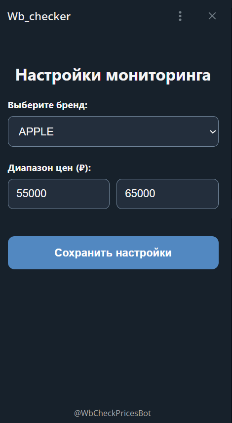
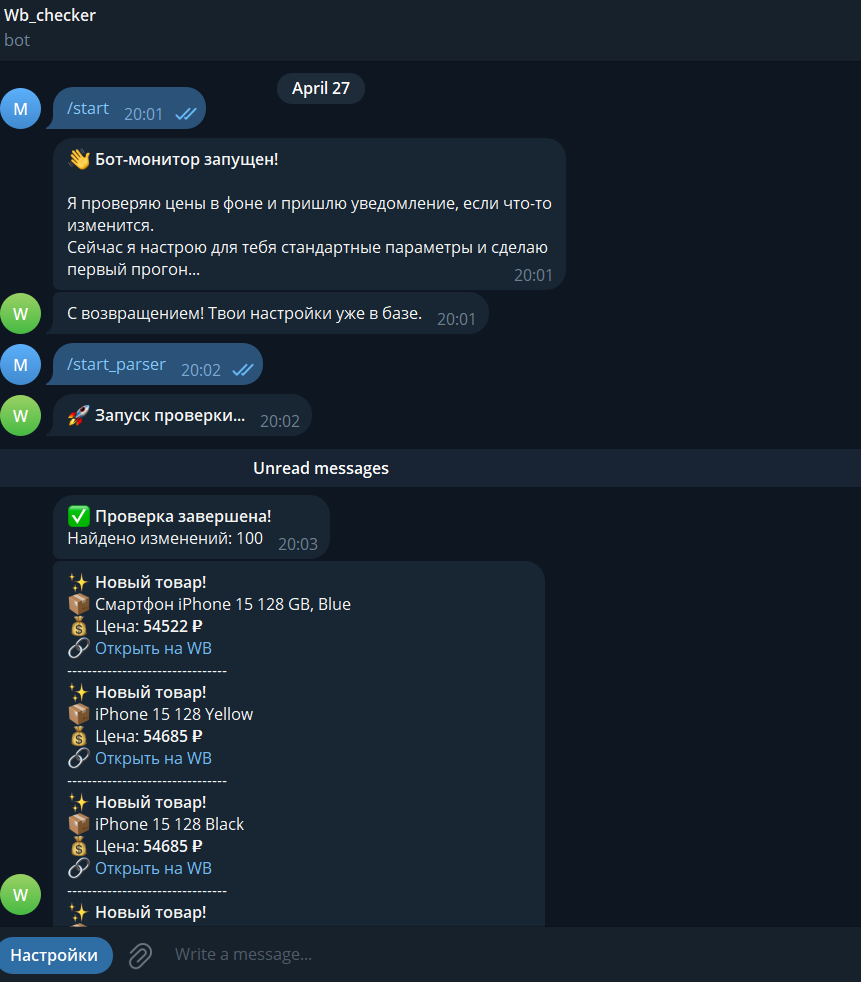

# 🛒 WB Price Monitor Bot

Автоматизированная система мониторинга цен на Wildberries с управлением через **Telegram Mini App**. 


---

## 📖 О проекте
Система позволяет отслеживать товары на Wildberries по заданным фильтрам (бренд, цена). Пользователь управляет мониторингом через удобное Telegram Mini App. Бот работает в фоне, используя Selenium для парсинга и PostgreSQL для хранения данных.

### Основной функционал:
* **Управление:** Настройка параметров мониторинга через Telegram Mini App.
* **Автоматизация:** Фоновый парсинг цен по расписанию (APScheduler).
* **Уведомления:** Оповещения при появлении новых товаров или снижении цены.
* **Оптимизация:** Группировка уведомлений, Docker-деплой, асинхронная архитектура.

---

## 📸 Интерфейс
<p align="center">
  
</p>

<p align="center">
  
</p>

---

## 🚀 Инструкция по запуску

### Предварительные требования
* Установленный [Docker Desktop](https://www.docker.com/).
* Установленный [Ngrok](https://ngrok.com/).
* Токен бота от [@BotFather](https://t.me/BotFather).

### Шаги установки
1. **Клонируйте репозиторий:**
   ```bash
   git clone https://github.com/mqrgn/wb-tracker.git
   cd wb-tracker
Настройте переменные:
Создайте файл .env на основе примера:
code
Bash
cp .env.example .env
Заполните его своими данными (токен бота, пароль БД, URL от Ngrok).
Запустите Ngrok:
Откройте отдельный терминал и выполните (замените ВАШ_ДОМЕН на ваш статический адрес):
code
Bash
ngrok http --domain=ВАШ_ДОМЕН 8000
Запуск Docker:
В папке с проектом выполните:
code
Bash
docker-compose up --build
Настройка в Telegram:
В настройках бота через @BotFather привяжите ваш домен Ngrok к кнопке Menu Button.
🛠 Технологический стек
Backend: FastAPI, Python 3.12
Database: PostgreSQL + SQLAlchemy 2.0 (Async)
Telegram: Aiogram 3.x
Scraping: Selenium (Chrome Headless)
DevOps: Docker, Docker Compose, Alembic

Проект разработан для автоматизации покупок и анализа цен.
